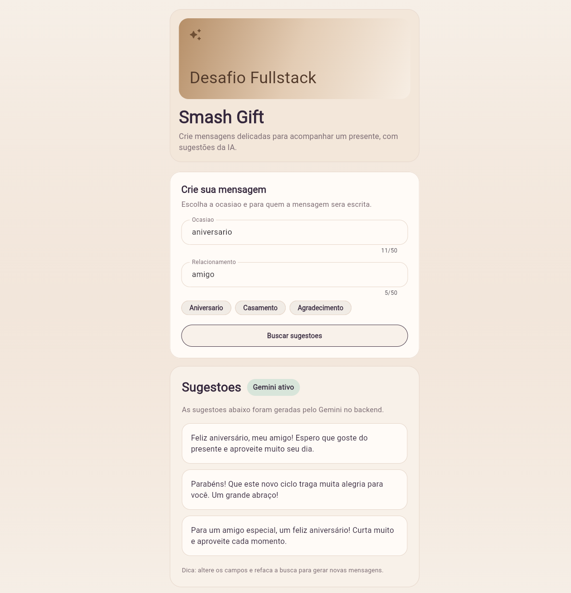

# Teste Senior Dev - Gerador de Mensagens para Gift Card

Este repositorio contem a solucao fullstack para o desafio de gerar sugestoes curtas de mensagens para gift card com apoio de LLM.

Demonstracao:



Estrutura:

```text
/
  backend/
  flutter_app/
  README.md
```

Documentacao detalhada:

- frontend Flutter: `flutter_app/README.md`
- backend Node.js: `backend/README.md`

Fluxo principal:

1. o usuario informa `occasion` e `relationship` no app Flutter
2. o app chama o backend em Node.js
3. o backend consulta o Gemini
4. a API devolve `2` ou `3` sugestoes curtas
5. se o Gemini falhar, o backend responde com fallback seguro

Arquitetura ponta a ponta:

```text
Flutter -> Backend -> Gemini -> fallback local
```

Como rodar o projeto completo:

## 1. Backend

```bash
cd backend
npm install
npm run build
node dist/src/server.js
```

API local:

```text
http://localhost:3000
```

## 2. Flutter web

Em outro terminal:

```bash
cd flutter_app
fvm install 3.38.0
fvm use 3.38.0
fvm flutter pub get
fvm flutter run -d chrome --dart-define=API_BASE_URL=http://localhost:3000
```

## 3. Flutter Android emulator

```bash
cd flutter_app
fvm flutter run --dart-define=API_BASE_URL=http://10.0.2.2:3000
```

Observacao:

- para detalhes de arquitetura, estrategias, testes e configuracao, consulte os READMEs de cada pasta

## Uso de IA

Foi utilizado o Codex como apoio de implementacao durante o desafio.

Forma de uso:

- o desafio foi primeiro dividido em tarefas
- a arquitetura foi organizada antes da implementacao
- foram definidos previamente os direcionamentos de seguranca, cache, fallback e TDD
- no backend, o Codex foi usado principalmente para geracao e iteracao de codigo
- no frontend Flutter, o Codex tambem foi usado para apoio na geracao dos testes automatizados

As decisoes de estrutura, trade-offs e organizacao geral da solucao foram conduzidas manualmente e refinadas ao longo da execucao.
